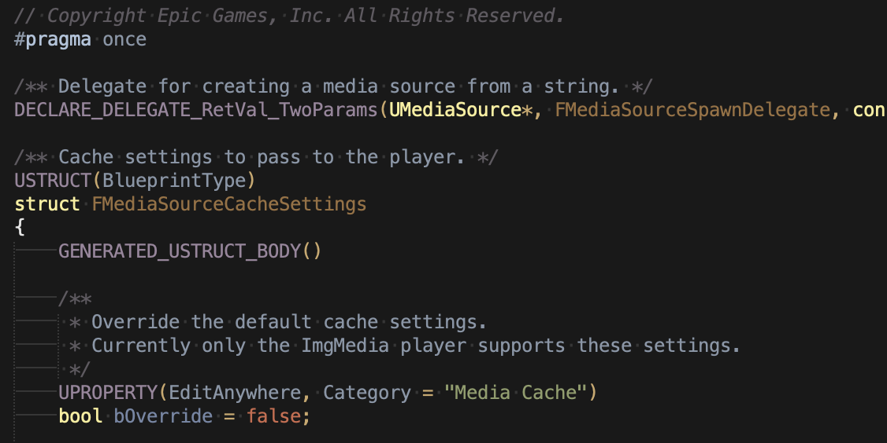

# ue-sublime
My scripts and configs for Sublime Text, including Unreal Engine-flavoured C++ syntax

Choose "Browse Packages ..." in Sublime settings, which will open a Packages folder. Copy everything from this repo over the top of that folder.

Stuff to document
* running syntax tests
* example build systems

## example of UE syntax



## example project file

```json
{
	"build_systems":
	[
		{
			"name": "Compile current file",
			"selector": "source.c++",
			"cmd":
			[
				"$project_path/Engine/Build/BatchFiles/Win64/Build.bat",
				"UnrealEditor", // context project name goes here
				"Win64",
				"Development",
				"-SingleFile=$file"
			],
			"working_dir": "$project_path"
		},
	],
	"folders":
	[
		{
			"path": "Engine",
			"folder_exclude_patterns": ["Binaries", "Content", "Intermediate", "Resources"]
		}
	]
}
```